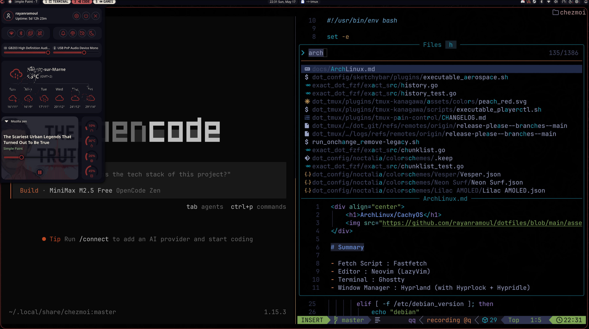

<div align="center">

<h1>RayTerm</h1>
<p><em>An opinionated, reproducible coding environment across Linux, macOS and Windows.</em></p>



</div>

## What is this?

A set of dotfiles + a package manifest that, in one command, gives you:

- Tiling window management on every OS — **Hyprland** (Linux), **AeroSpace** (macOS), **GlazeWM** (Windows).
- Coherent keybindings across all three (mapped to `SUPER` on Linux/Windows, `Alt` on macOS).
- Terminal-first stack — **zsh** + **tmux** + **Neovim (LazyVim)** + **Ghostty**.
- Rose-Pine theming everywhere — GTK / Qt (Kvantum) / KDE / terminal.
- AI-native — Claude Code, Ollama, LM Studio, opencode wired in.
- Everything managed by [chezmoi](https://chezmoi.io), with private agent configuration encrypted using age.

## Quick install

```bash
export CHEZMOI_AGE_KEY_FILE=/path/to/securely-restored-key.txt
curl -fsSL https://raw.githubusercontent.com/rayanramoul/dotfiles/master/install.sh | bash
```

The age identity is intentionally not stored in Git. Back it up securely and
restore it before the first apply.

Or manual:

```bash
# 1. Install chezmoi
sh -c "$(curl -fsLS get.chezmoi.io)"

# 2. Initialize the source state
chezmoi init https://github.com/rayanramoul/dotfiles

# 3. Restore the age identity, then apply
install -Dm600 /path/to/securely-restored-key.txt ~/.config/chezmoi/key.txt
chezmoi apply
```

## Stack at a glance

| Layer | Linux (Arch / CachyOS) | macOS | Windows |
| --- | --- | --- | --- |
| Window manager | Hyprland | AeroSpace | GlazeWM |
| Status bar | Noctalia | SketchyBar (+ JankyBorders) | GlazeWM bar |
| Launcher | Noctalia | Raycast | Wox |
| Terminal | Ghostty | Ghostty | Alacritty / Windows Terminal |
| Shell | zsh + Starship + Atuin | same | same (via WSL) |
| Editor | Neovim (LazyVim) | same | same |
| Multiplexer | Tmux (rose-pine theme) | same | same |
| File manager | Yazi (TUI) / Dolphin (GUI) | Yazi / Finder | Yazi / Explorer |
| Lock / idle | Hyprlock + Hypridle | — | — |
| Wallpaper | Noctalia | — | — |
| Notifications | Noctalia | native | native |
| Screenshots | grim + slurp + satty | Shottr | — |
| Theme | Rose-Pine (GTK / Kvantum / KDE / Terminal) | same | same |

CLI tools include `bat`, `lsd`, `fzf`, `ripgrep`, `fd`, `zoxide`, `atuin`, `starship`, `just`, `git-delta`, `difftastic`, `lazygit`, `lazydocker`, `bpytop`, `tealdeer`, `glow`, `dive`, `topgrade`, `fastfetch`, `onefetch`, and `presenterm`.

## Keybindings

Open the live cheatsheet anytime with **`SUPER + /`** (renders via `glow` in a floating Ghostty).

### Apps & system

| Key | Action |
| --- | --- |
| `SUPER + Return` | Open terminal (Ghostty) |
| `SUPER + Q` | Kill focused window |
| `SUPER + Space` | Vicinae launcher |
| `SUPER + Ctrl + E` | Emoji picker |
| `SUPER + E` | File manager (Dolphin) |
| `SUPER + V` | Toggle floating |
| `SUPER + F` | Toggle fullscreen |
| `SUPER + P` | Pin / unpin active window |
| `SUPER + /` | Open this cheatsheet |
| `SUPER + X` | Lock (`hyprlock`) |
| `SUPER + End` | Region screenshot → satty → clipboard |
| `SUPER + W` / `Shift + W` | Next / previous wallpaper |
| `SUPER + C` | Zen browser at chat.com (workspace 2) |
| `SUPER + Shift + D` | Ghostty + nvim in chezmoi source |
| `SUPER + Shift + A` | `chezmoi apply` + reload Hyprland |
| `SUPER + Shift + C` | Notes tmux session |
| `SUPER + Shift + M` | Supersonic (music) |
| `SUPER + Shift + O` | Obsidian (vault) |
| `SUPER + Shift + V` | Toggle Noctalia clipboard history |

### Focus & movement

| Key | Action |
| --- | --- |
| `SUPER + H/J/K/L` or arrows | Focus left / down / up / right |
| `SUPER + Shift + H/J/K/L` | Move window |
| `SUPER + Ctrl + H/J/K/L` | Resize (20px or column preset) |
| `SUPER + Comma` / `Period` | Focus monitor left / right |
| `SUPER + Tab` | Toggle previous workspace |
| `SUPER + 1-0` | Switch workspace 1-10 |
| `SUPER + Shift + 1-0` | Move window to workspace |
| `SUPER + S` / `Shift + S` | Toggle / move-to scratchpad |
| `SUPER + Wheel` | Cycle workspaces |
| `SUPER + LMB` / `RMB` | Drag / resize with mouse |

### Workspaces (auto-routed by class)

| WS | Name | Monitor | Routes |
| --- | --- | --- | --- |
| 1 | 󰆍 terminal | DP-1 | Ghostty, Alacritty, Kitty |
| 2 | 󰖟 browser | DP-2 | Zen, Helium, Firefox, Chrome |
| 3 | 󰨞 code | DP-1 | VSCode, Cursor |
| 4 | 󰭹 chat | DP-2 | Discord, Slack, Signal, Spotify |
| 5 | 󰊗 games | DP-1 | Steam, Lutris, Heroic, wine |
| 6 | 󰒍 vault | DP-2 | Bitwarden, Obsidian, GIMP, Inkscape |
| 7 | 󰋋 media | DP-2 | Supersonic, Stremio |
| 8-10 | 󰀻 misc | — | transmission-qt, scratch |

### Media

| Key | Action |
| --- | --- |
| `XF86AudioPlay` / `Prev` / `Next` | `playerctl` |
| `XF86AudioRaise/LowerVolume` | `pactl` ±5% |
| `XF86AudioMicMute` | mic mute toggle |
| `XF86MonBrightnessUp/Down` | `brightnessctl` ±5% |

## Apps & system map

- **Browser** — Zen Browser (Helium also installed)
- **File explorer** — Yazi (TUI), Dolphin (GUI)
- **Clipboard** — Noctalia history, `wl-clipboard` tools
- **Audio** — PipeWire stack (`pipewire-pulse`, `wireplumber`, `pavucontrol`)
- **Bluetooth** — `overskride`
- **Networking** — `nm-connection-editor` (tray via Noctalia)
- **Notifications** — Noctalia
- **Color picker** — `hyprpicker` (planned)
- **Music** — Supersonic (Navidrome client, rose-pine themed)
- **Video / streaming** — mpv (with yt-dlp), Stremio
- **Notes** — Obsidian (vault) + `~/Documents/Notes` (nvim via `SUPER + Shift + C`)
- **Messaging** — Signal, Discord
- **Local LLMs** — `ollama-cuda`, `lmstudio-bin`
- **Coding agents** — [Claude Code](#claude-code-setup), `opencode`
- **Gaming** — Steam + ProtonPlus, Lutris, Heroic, SteamTinkerLaunch
- **Documents** — `zathura` (PDF), `glow` (markdown)
- **Backups** — _TODO: restic_

## Per-OS notes

### Arch / CachyOS

- All packages declared in `home/.chezmoidata/packages.yaml` and installed via `paru` by `home/.chezmoiscripts/run_onchange_install-packages.sh.tmpl`.
- Autostart entries (Noctalia, Hypridle, Udiskie, etc.) live in `home/dot_config/hypr/autostart.lua`.
- Quick OS bootstrap: boot the Arch ISO → `archinstall` → log in → follow the bootstrap steps above. NVIDIA drivers, kernel mode-setting, multilib: see the [Arch wiki — NVIDIA](https://wiki.archlinux.org/title/NVIDIA).

### macOS

- AeroSpace replaces Yabai/skhd (no SIP changes required): `brew install --cask nikitabobko/tap/aerospace`.
- SketchyBar + JankyBorders for the bar / focus ring: `brew install sketchybar borders`.
- After applying: `aerospace reload-config && brew services restart sketchybar`.
- Best-spotlight: [Raycast](https://manual.raycast.com/).

### Windows

- Run inside [WSL Arch](https://github.com/yuk7/ArchWSL) for shell parity.
- Native side: [GlazeWM](https://github.com/glzr-io/glazewm) (config at `home/dot_config/glaze_config.yaml`), [Wox](https://github.com/Wox-launcher/Wox/releases) launcher, optional [ExplorerPatcher](https://github.com/valinet/ExplorerPatcher) to hide the taskbar.
- `wsl --set-default Arch`, then follow the bootstrap steps from inside WSL.

## AI tooling

- **[Claude Code](https://claude.com/claude-code)** is the main coding agent. Install: `npm install -g @anthropic-ai/claude-code`. Optional [`claude-diff`](https://github.com/gandarfh/claude-diff) hook for visual diffs of proposed edits.
- **Ollama (CUDA)** + **LM Studio** for local model hosting.
- Neovim integrations: `claude-code.nvim`, `minuet-ai`, `codediff` / `vscode-diff` for AI-edit previews. Config in `home/dot_config/nvim/lua/plugins/`.

### Local LLM Stack (llama-server + OpenWebUI + opencode)

The local LLM setup uses **llama-server** (llama.cpp) as the inference server, **OpenWebUI** as the web interface, and **opencode** as the CLI agent.

#### Components

| Component | Config Location | Description |
|-----------|---------------|-------------|
| llama-server | `.config/systemd/user/llama-cpp.service` | Systemd user service running Qwen3.6-35B model on port 18081 |
| OpenWebUI | `home/scripts/executable_deploy_openwebui.sh` | Docker deployment with `--network host` |
| opencode | `home/dot_config/opencode/opencode.jsonc.tmpl` | CLI agent config (public parts) |

#### Setup

1. **Build llama.cpp** (once):
   ```bash
   ~/scripts/install_llama_cpp.sh
   ```

2. **Download model**:
   ```bash
   ~/scripts/download_models.sh
   ```

3. **Deploy OpenWebUI**:
   ```bash
   ~/scripts/deploy_openwebui.sh
   ```

4. **Start services**:
   ```bash
   systemctl --user enable --now llama-cpp
   ```

5. **Access**:
   - OpenWebUI: http://localhost:8080
   - llama-server API: http://localhost:18081/v1

#### Current Model

- **Qwen3.6-35B-IQ4_XS.gguf** (18 GB)
- Context size: 120,000 tokens
- Downloaded from HuggingFace: `mradermacher/Qwen3.6-35B-Instruct-GGUF`

#### Updating the Model

1. Edit `home/scripts/executable_download_models.sh` to change the model repo/symlink

2. Re-run the download script:
   ```bash
   ~/scripts/download_models.sh
   ```

3. Update systemd service (`~/.config/systemd/user/llama-cpp.service`) if model name changes:
   ```ini
   ExecStart=/home/.../llama-server --model /home/.../llama-models/[model].gguf --ctx-size 120000 ...
   ```

4. Reload and restart:
   ```bash
   systemctl --user daemon-reload
   systemctl --user restart llama-cpp
   ```

5. Update opencode config template (`home/dot_config/opencode/opencode.jsonc.tmpl`) with new model name and context size, then run `chezmoi apply`

#### Troubleshooting

- **OpenWebUI can't reach llama-server**: Ensure `--network host` is used in docker run, and `OPENAI_API_BASE_URL=http://127.0.0.1:18081/v1`
- **Model not loading**: Check `journalctl --user -u llama-cpp` for errors
- **Port conflict**: llama-server defaults to port 18081

## Repo layout

```
.chezmoiroot                       # tells chezmoi to read source state from home/
home/                              # managed home-directory source state
├── .chezmoidata/packages.yaml     # packages, per OS
├── .chezmoiscripts/               # lifecycle and installation scripts
├── .chezmoitemplates/             # shared template fragments
├── dot_claude/                    # encrypted private agent config + public hooks
├── dot_config/                    # -> ~/.config/
├── private_dot_ssh/               # mode-0600 SSH configuration
└── scripts/                       # -> ~/scripts/
justfile                           # `just apply / diff / bootstrap / upgrade`
docs/cheatsheets/                  # git, ssh, vscode reference cards
docs/skyrim-thana-khan-linux/      # running a 1,800-mod Skyrim modlist under Proton
wallpapers/                        # repository-local Noctalia wallpapers
```

`just` recipes wrap the common chezmoi flows: `just apply`, `just diff`, `just bootstrap <repo>`, `just upgrade` (topgrade), `just unmanaged` (find files chezmoi doesn't track).

## Cheatsheets

Outside-the-stack reference material lives in [`docs/cheatsheets/`](docs/cheatsheets/) — short notes on git, ssh, and a vscode PDF. Use `glow docs/cheatsheets/git.md` for in-terminal rendering.

## Gaming

[`docs/skyrim-thana-khan-linux/`](docs/skyrim-thana-khan-linux/) documents getting the Thana Khan Modspack v8.4 (1,800 mods, Windows-only by design) running on CachyOS under Proton — every Linux-specific failure and its fix, plus the launcher, deploy and audit scripts.

## ❤️ If RayTerm has been helpful

Star the repo — it helps others discover it.
